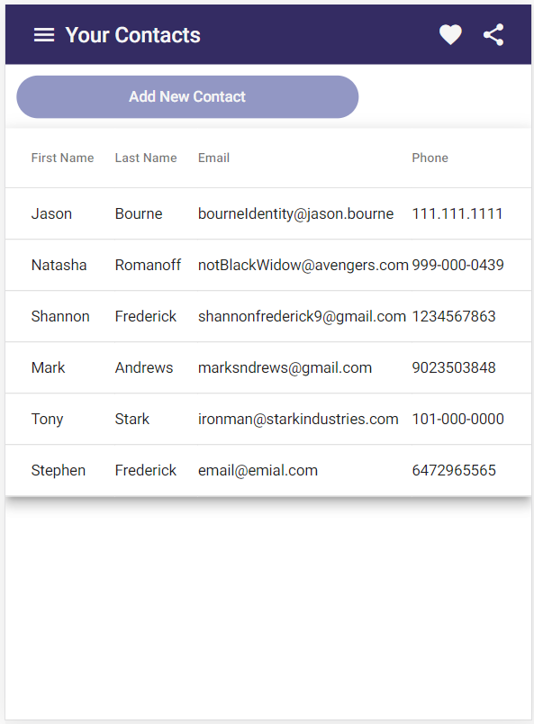
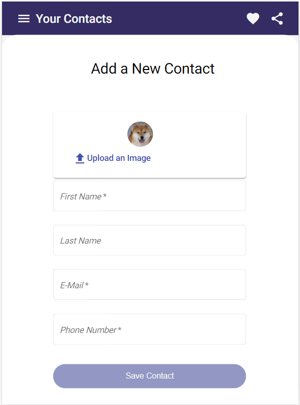

# Interview App

Interview Feb 25/2021 - WeUsThem

### Framework

For this application, I used Angular and Node.js with Firestore as the database.  I was going to avoid using 
a database however, having no experience working backend yet (still in school) I decided mid-day that I would be able to produce
the most functionality if I were to utilize Firebase's Cloud Firestore.  

### How it Works
The main screen is the page with the table of contacts.  I wanted to use an accordian menu component but due to the late decision to work with Firestore, 
I was not able to implement it and stuck with a table to have the contacts viewable for the purpose of this test.  

The button on the top will take user to 
an Add Contact screen where the data will be checked and, if valid, saved in the database upon submission of the form.  

When the data is saved, the user is redirected to the home screen of contacts and will be able to see their new contact there.  These contacts are all saved to the database and will be accessible
at any time.  

Update and Delete functions were added to the files however they were not implemented on the UI due to time constraints.     

### How to run
To run the code "ng serve" in the terminal will start both the frontend and the node server.  The application will then open on localhost.  It was made for mobile screen size so it will not look proper on full desktop view. 

